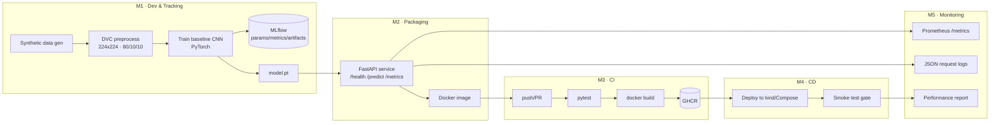

# MLOps Pipeline — Cats vs Dogs Image Classification

An end-to-end MLOps pipeline for binary image classification (Cats vs Dogs),
covering model development, experiment tracking, packaging, containerization,
and CI/CD-based deployment with monitoring — built entirely with open-source
tools.

> The pipeline ships with a **synthetic** Cats-vs-Dogs dataset generator so the
> whole flow (versioning → training → serving → CI/CD → monitoring) runs
> end-to-end without a multi-GB download. Swap in the real Kaggle dataset by
> dropping images into `data/raw/cats` and `data/raw/dogs` (see
> [Using the real dataset](#using-the-real-kaggle-dataset)).

---

## Tech stack

| Concern | Tool |
|---|---|
| Source versioning | Git |
| Data/model versioning | DVC |
| Model | PyTorch (baseline CNN) |
| Experiment tracking | MLflow |
| Inference API | FastAPI + Uvicorn |
| Containerization | Docker |
| CI / CD | GitHub Actions |
| Registry | GitHub Container Registry (GHCR) |
| Deployment | Docker Compose **and** Kubernetes (kind/minikube) |
| Monitoring | Prometheus + structured JSON logging |
| Testing | pytest |

---

## Architecture



---

## Project structure

```
.
├── src/
│   ├── config.py                 # loads params.yaml
│   ├── data/
│   │   ├── generate_synthetic.py # M1 · synthetic dataset
│   │   └── preprocess.py         # M1 · resize/split + inference transform
│   ├── models/
│   │   ├── model.py              # M1 · SimpleCNN architecture
│   │   ├── train.py              # M1 · training + MLflow tracking
│   │   └── inference.py          # M2 · load_model / predict (testable)
│   └── api/
│       ├── main.py               # M2 · FastAPI app (+ M5 logging/metrics)
│       ├── schemas.py            # response models
│       └── metrics.py            # M5 · Prometheus metrics
├── tests/                        # M3 · pytest unit + API tests
├── scripts/
│   ├── smoke_test.py             # M4 · post-deploy smoke test
│   └── simulate_requests.py      # M5 · labeled requests + accuracy report
├── k8s/                          # M4 · Deployment + Service (+ kustomization)
├── argocd/application.yaml       # M4 · optional Argo CD GitOps
├── monitoring/prometheus.yml     # M5 · Prometheus scrape config
├── .github/workflows/
│   ├── ci.yml                    # M3 · test + build + push to GHCR
│   └── cd.yml                    # M4 · deploy to kind + smoke test
├── Dockerfile                    # M2 · containerized inference service
├── docker-compose.yml            # M4 · Compose deployment + Prometheus
├── dvc.yaml / params.yaml        # M1 · reproducible pipeline + config
├── requirements.txt              # M2 · pinned runtime deps
├── requirements-dev.txt          # pinned dev/training deps
└── Makefile                      # convenience targets
```

---

## Quickstart

### 1. Setup

```bash
make venv          # create .venv + install pinned deps (CPU torch)
source .venv/bin/activate
```

<details>
<summary>Manual setup (without make)</summary>

```bash
python3 -m venv .venv && source .venv/bin/activate
pip install --index-url https://download.pytorch.org/whl/cpu torch==2.2.2 torchvision==0.17.2
pip install -r requirements-dev.txt
```
</details>

### 2. M1 — Reproduce the pipeline (data → preprocess → train)

```bash
dvc repro                      # runs all 3 stages, writes dvc.lock
# or step-by-step:
python -m src.data.generate_synthetic
python -m src.data.preprocess
python -m src.models.train
```

Artifacts produced:
- `models/model.pt` — serialized PyTorch checkpoint
- `models/metrics.json` — test/val/train accuracy (DVC-tracked metric)
- `models/plots/{training_curves,confusion_matrix}.png`
- `mlruns/` — MLflow experiment (params, metrics, artifacts)

View experiments:

```bash
mlflow ui            # http://127.0.0.1:5000
dvc metrics show     # tabular metrics
```

### 3. M3 — Run tests

```bash
pytest -v            # 16 unit + API tests
```

### 4. M2 — Run the API locally

```bash
uvicorn src.api.main:app --reload --port 8000
```

```bash
# health check
curl http://localhost:8000/health
# prediction
curl -F "file=@path/to/image.jpg" http://localhost:8000/predict
# interactive docs: http://localhost:8000/docs
```

### 5. M2 — Build & run the container

```bash
make docker-build            # docker build -t cats-vs-dogs:latest .
make docker-run              # docker run -p 8000:8000 cats-vs-dogs:latest
python scripts/smoke_test.py --url http://localhost:8000
```

### 6. M4 — Deploy

**Docker Compose** (service + Prometheus):

```bash
docker compose up --build -d
# service : http://localhost:8000
# metrics : http://localhost:9090   (Prometheus)
python scripts/smoke_test.py --url http://localhost:8000
docker compose down
```

**Kubernetes** (kind / minikube):

```bash
# build image and load it into the local cluster
docker build -t cats-vs-dogs:ci .
kind load docker-image cats-vs-dogs:ci          # or: minikube image load cats-vs-dogs:ci

kubectl apply -k k8s/
kubectl rollout status deployment/cats-vs-dogs
kubectl port-forward svc/cats-vs-dogs 8000:80 &
python scripts/smoke_test.py --url http://localhost:8000
```

### 7. M5 — Monitoring & post-deployment performance

```bash
# structured JSON request logs are emitted by the service (see container logs)
curl http://localhost:8000/metrics                 # Prometheus metrics
python scripts/simulate_requests.py --url http://localhost:8000 --n 40
cat monitoring/performance_report.json             # accuracy + latency + confusion
```

---

## CI/CD

### CI — `.github/workflows/ci.yml` (M3)
On every push / PR to `main`:
1. checkout → install deps → **run pytest**
2. on `main`: reproduce training, **build the Docker image**, and **push to GHCR**
   (`ghcr.io/<owner>/<repo>:latest` and `:sha-<commit>`).

### CD — `.github/workflows/cd.yml` (M4)
Triggered automatically when CI succeeds on `main`:
1. pulls the freshly-built image from GHCR
2. spins up an ephemeral **kind** Kubernetes cluster and applies `k8s/`
3. runs the **smoke test** (health + one prediction) — **fails the pipeline if it fails**
4. runs the post-deployment performance check

> **GitOps alternative:** `argocd/application.yaml` lets Argo CD continuously
> sync `k8s/` to a cluster on `main` changes. Point `repoURL` at your fork.

---

## Configuration

All tunables live in [`params.yaml`](params.yaml) (image size, splits, epochs,
batch size, learning rate, MLflow experiment name). DVC tracks these params and
re-runs only the affected stages when they change.

---

## Monitoring & logging (M5)

- **Request/response logging** — every request is logged as structured JSON
  (method, path, status, latency, client) via `python-json-logger`. Raw image
  bytes are never logged; predictions log only metadata (filename, size, label,
  confidence, latency).
- **Metrics** — `/metrics` exposes Prometheus counters/histograms:
  `http_requests_total`, `http_request_duration_seconds`,
  `model_predictions_total{predicted_class}`, `model_inference_duration_seconds`.
- **Post-deployment performance** — `scripts/simulate_requests.py` sends a batch
  of *labeled* requests, compares predictions to ground truth, and writes
  `monitoring/performance_report.json` (accuracy, avg latency, confusion counts).

---

## Using the real Kaggle dataset

1. Download the Kaggle *Dogs vs. Cats* dataset.
2. Place images under `data/raw/cats/` and `data/raw/dogs/`.
3. Skip the `generate_data` stage and run:
   ```bash
   python -m src.data.preprocess
   python -m src.models.train
   ```
   (or remove the `generate_data` stage from `dvc.yaml` and `dvc repro`).

The preprocessing already resizes to **224×224 RGB**, splits **80/10/10**, and
applies **data augmentation** (flip/rotation/color-jitter) on the training set.

---

## Notes

- CPU-only PyTorch is used everywhere for portability and small images.
- `numpy` is pinned to `1.26.4` and `setuptools` to `70.3.0` for compatibility
  with `torch==2.2.2` and `mlflow==2.12.1` respectively.
- The DVC pipeline commands use `python`, so **activate the venv** before
  `dvc repro`.
